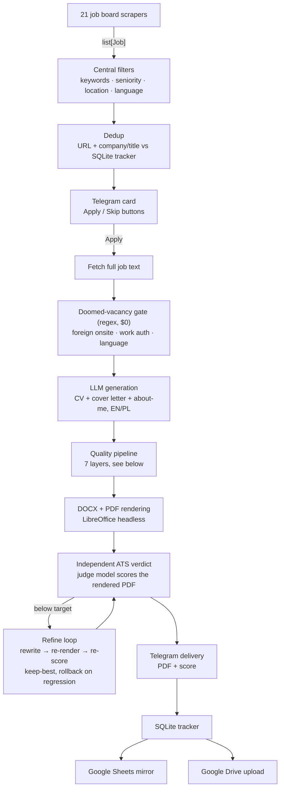

# Job Hunter Bot

[](https://github.com/igrdevelop/job-hunter/actions/workflows/deploy.yml)


[](https://github.com/astral-sh/ruff)
[](LICENSE)

An autonomous job-hunting system: it scrapes **21 IT job boards**, filters vacancies
against a candidate profile, generates a **tailored CV + cover letter per vacancy**
with an LLM, verifies every generated claim through a multi-stage quality pipeline,
and delivers ready-to-send PDFs to Telegram — with full tracking in Google Sheets
and document storage on Google Drive.

Built as a real production tool (running 24/7 in Docker on a VPS), not a demo:
every generated document goes to actual employers, so the system is designed around
one hard rule — **a broken or dishonest CV must never leave the pipeline**.

---

## Highlights

- **21 scraper sources** — Polish boards (JustJoin.it, NoFluffJobs, Pracuj.pl,
  theprotocol.it…), global remote boards (RemoteOK, Himalayas, WeWorkRemotely…),
  LinkedIn, Gmail job alerts, and a multi-provider ATS aggregator
  (Workable / Greenhouse / Lever / Recruitee / Ashby). Strategies range from JSON
  APIs and RSS to `__NEXT_DATA__` parsing, cloudscraper for Cloudflare-protected
  sites, and Playwright for SPA-only boards.
- **Telegram as the control plane** — new vacancies arrive as cards with
  Apply / Skip buttons; 20+ commands cover hunting, funnel analytics, scraper
  health, LLM model switching, and Google Sheets sync.
- **Seven-layer defense against LLM hallucinations** (see below) — prompt rules
  alone are never trusted; deterministic post-controls and an independent
  LLM-as-judge verify every claim before delivery.
- **Independent ATS verdict** — the final score shown to the user comes from a
  *different* model scoring the text extracted from the **rendered PDF** (what a
  real ATS parses), not from the generator grading its own work.
- **A/B model comparison in production** (dual-apply) — every application can be
  shadow-generated by a second LLM (e.g. DeepSeek) and scored by the same judge,
  enabling data-driven model choice.
- **Cost-engineered** — prompt caching, deterministic early-exit in the ATS
  keyword loop, cheap judge model: **~$0.13–0.17 per tailored application**
  (down from $0.38 after a data-driven optimization across 713 production runs).
- **1700+ tests**, full suite in ~14 seconds; ruff-gated CI; PR-based history
  with root-cause analysis documented for every production incident.

## How it works



## The quality pipeline

The core engineering problem: LLMs fabricate. A prompt that says *"never invent
client names"* still occasionally produces "Fortune 500 clients". This system
assumes prompts fail and enforces honesty in layers:

| # | Layer | Mechanism |
|---|-------|-----------|
| 1 | Prompt RED LINES | Generation rules with explicit prohibitions |
| 2 | Deterministic scrubs | Regex removal of compliance/prestige claims, skill-gloss dedup |
| 3 | Claim judge | A second, independent LLM verifies every claim against the candidate profile + job posting; findings are quote-validated verbatim so the judge's own hallucinations are neutralized |
| 4 | Language gate | Detects Polish contamination in English documents (and vice versa); repairs by translating from the clean counterpart — or **blocks delivery** |
| 5 | PDF roundtrip | Scores the text a real ATS would extract from the rendered PDF, not the JSON source |
| 6 | Independent verdict | A model that did **not** write the resume produces the only user-facing ATS score |
| 7 | Refine loop | Rewrites against the verdict's feedback with a strict keep-best guard — a worse round is rolled back byte-for-byte, so regression is impossible by construction |

Honesty is architectural: the refine loop may surface technologies from the job
posting, but every such addition is logged as a visible "To Learn" debt in the
tracker and can never be attached to verifiable past employers.

## Telegram commands (selection)

| Command | Purpose |
|---|---|
| `/hunt [source]` | Run a hunt cycle (all sources or one) |
| `/force <url>` | Force-generate an application for a URL |
| `/funnel [days]` | Conversion funnel: tracked → generated → sent → confirmed → answered, per source |
| `/health` | Per-source scraper yield report with breakage detection |
| `/llm [profile]` | Show / switch the active LLM (Sonnet, DeepSeek, GPT) at runtime |
| `/dual on\|off` | Toggle A/B shadow generation |
| `/status`, `/unsent`, `/check_expired`, `/check_responses` | Tracker operations |

## Quick start

```bash
git clone https://github.com/igrdevelop/job-hunter.git
cd job-hunter
pip install -r requirements.txt && pip install -e . --no-deps

cp .env.example .env        # fill in TELEGRAM_BOT_TOKEN, TELEGRAM_CHAT_ID, ANTHROPIC_API_KEY
# edit prompts/candidate_profile.md — your experience, skills, preferences

python hunter.py            # starts the Telegram bot + scheduler
```

Docker deployment (GHCR image built by CI, LibreOffice + Playwright included):

```bash
docker compose up -d
```

See [docs/DEPLOY.md](docs/DEPLOY.md) for the full VPS deployment guide and
[CLAUDE.md](CLAUDE.md) for the complete architecture reference (config table,
tracker schema, pipeline internals).

> **Note:** the `prompts/` directory in this repo contains the author's own
> candidate profile and base CVs — replace them with yours before running.
> Optional integrations (Google Sheets mirror, Drive upload, Gmail alerts)
> each need a one-time OAuth setup described in CLAUDE.md.

## Tech stack

Python 3.11+ · [python-telegram-bot](https://github.com/python-telegram-bot/python-telegram-bot) (async) ·
Anthropic / OpenAI / OpenRouter APIs · SQLite (WAL) · openpyxl + python-docx ·
LibreOffice headless (PDF rendering) · cloudscraper + Playwright (scraping) ·
Google Sheets / Drive / Gmail APIs · Docker + GitHub Actions → GHCR → VPS

## Testing

```bash
ruff check .        # lint (CI gate)
pytest tests/       # 1700+ tests, ~14 s
```

Scrapers are covered by fixture-based parsing tests; the quality pipeline by
unit tests per layer; filter rules by regression tests distilled from real
production postings (the doomed-vacancy gate was calibrated against ~450 real
job postings with a zero-false-positive acceptance bar).

## Project docs

- [CLAUDE.md](CLAUDE.md) — full architecture reference & agent work log
- [docs/ARCHITECTURE.md](docs/ARCHITECTURE.md) — system overview
- [docs/review-2026-07/](docs/review-2026-07/README.md) — latest project review & roadmap
- [docs/](docs/) — design docs for major features (claim judge, verdict refine loop, doomed-vacancy gate, calibration reports)

## License

[MIT](LICENSE)
